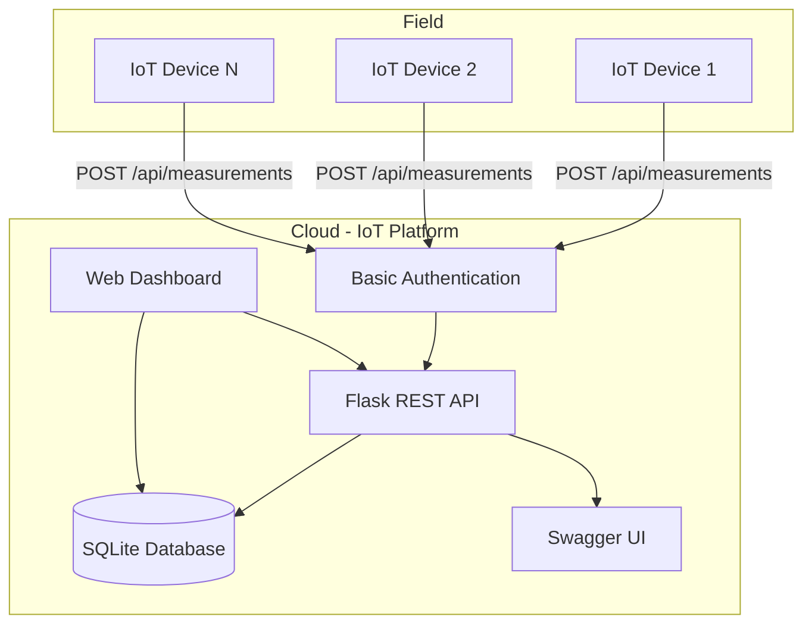
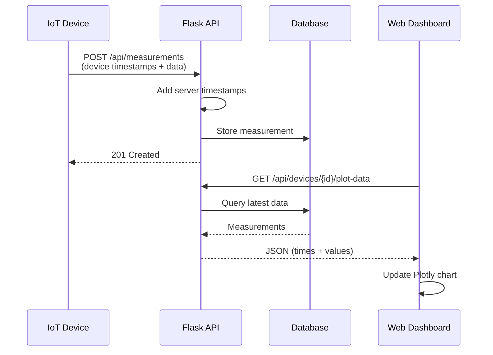
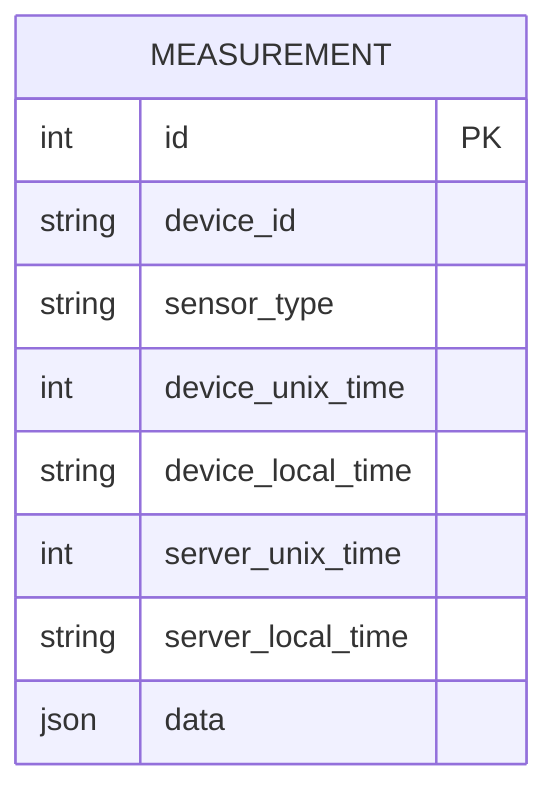
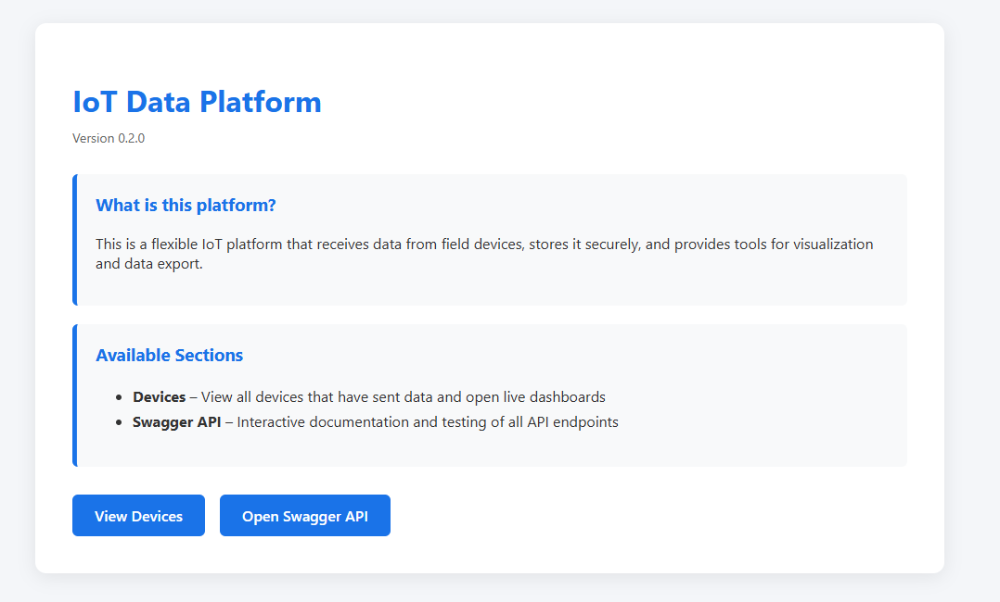
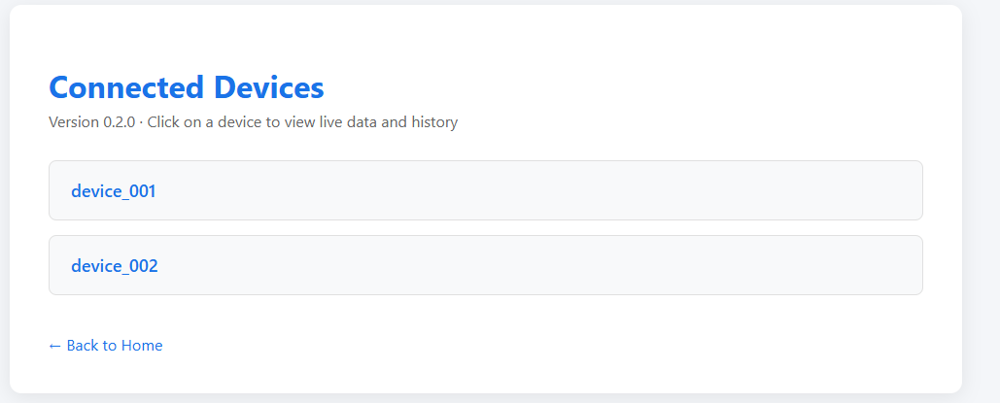
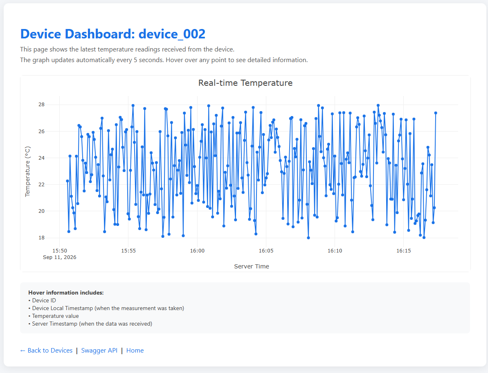
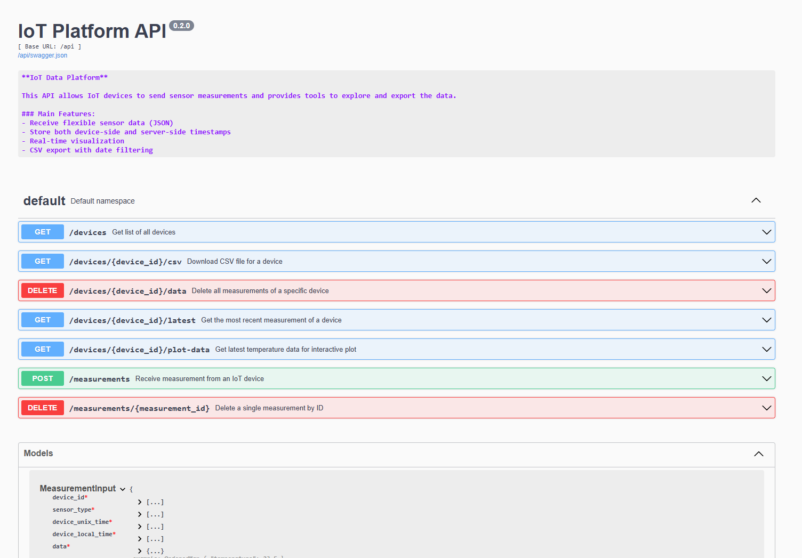

# IoT Data Platform

A flexible IoT data collection and visualization platform built with **Python, Flask, SQLAlchemy, and SQLite**.

Field devices can send sensor measurements to the cloud. The platform stores the data with both device-side and server-side timestamps, provides interactive real-time dashboards, and offers a complete REST API with Swagger documentation.

---

## Features

- Receive flexible sensor data from IoT devices (JSON payload)
- Store four timestamps for every measurement:
  - Device Unix time
  - Device local time
  - Server Unix time
  - Server local time
- Interactive real-time temperature dashboard (Plotly)
- Device list page
- CSV export with date range filtering
- Full Swagger / OpenAPI documentation
- HTTP Basic Authentication
- Delete single measurement or all data of a device via API
- Environment variables for secrets (`.env`)

---

## Technology Stack

| Component              | Technology            |
|------------------------|-----------------------|
| Language               | Python                |
| Web Framework          | Flask                 |
| API Documentation      | Flask-RESTX (Swagger) |
| Database ORM           | Flask-SQLAlchemy      |
| Database               | SQLite                |
| Authentication         | Flask-HTTPAuth        |
| Interactive Charts     | Plotly.js             |
| Package Management     | uv                    |
| Hosting                | Render                |

---

## Architecture



---

## Data Flow



---

## Project Structure

```text
iot-platform/
├── app.py
├── devices/
│   └── temperature_sensor.py
├── templates/
│   ├── index.html
│   ├── devices.html
│   └── device_detail.html
├── .env                  ← Secrets
├── .gitignore
├── pyproject.toml
├── uv.lock
└── README.md
```

---

## Database Schema



The `data` column is a JSON field. This allows different sensors to send different structures, for example:

```json
{"temperature": 23.5}
```

```json
{"temperature": 22.1, "humidity": 55, "pressure": 1013}
```

---

## Main Endpoints

| Method | Endpoint                              | Description                              |
|--------|---------------------------------------|------------------------------------------|
| POST   | `/api/measurements`                   | Receive data from an IoT device          |
| GET    | `/api/devices`                        | List all devices                         |
| GET    | `/api/devices/{device_id}/latest`      | Get latest measurement of a device       |
| GET    | `/api/devices/{device_id}/plot-data`   | Data for real-time plot                  |
| GET    | `/api/devices/{device_id}/csv`         | Download CSV (with optional date range)  |
| DELETE | `/api/measurements/{id}`              | Delete a specific measurement            |
| DELETE | `/api/devices/{device_id}/data`        | Delete all data of a device              |

---

## Screenshots

### Home Page
<!-- SCREENSHOT: Save as docs/screenshots/home.png -->


### Devices List
<!-- SCREENSHOT: Save as docs/screenshots/devices.png -->


### Device Live Dashboard
<!-- SCREENSHOT: Save as docs/screenshots/dashboard.png -->


### Swagger API
<!-- SCREENSHOT: Save as docs/screenshots/swagger.png -->


---

## Local Development

### 1. Clone the repository

```bash
git clone https://github.com/HaMadadian/iot-platform.git
cd iot-platform
```

### 2. Install dependencies

```bash
uv sync
```

### 3. Create `.env` file

```env
BASIC_AUTH_USERNAME=admin
BASIC_AUTH_PASSWORD=your_strong_password
API_BASE_URL=http://127.0.0.1:5000
```

### 4. Run the application

```bash
uv run python app.py
```

### 5. Run a simulated device (optional)

```bash
uv run python devices/temperature_sensor_XXX.py
```

---

## Authentication

All routes are protected with HTTP Basic Authentication.  
Credentials are loaded from environment variables (or `.env` file for local development).

---

## Deployment on Render

This project is designed to be deployed on Render’s free web service plan.

**Important notes about the free plan:**

- The service sleeps after ~15 minutes of inactivity
- The SQLite database is temporary (data is lost on restart/sleep)
- For production use, a managed PostgreSQL database is recommended

---

## Future Improvements

- PostgreSQL instead of SQLite
- Device registration and API keys
- User accounts and multi-tenancy
- Background data processing
- Machine Learning predictions
- Sending control commands back to actuators
- Alerting system

---

## Author

Hamed Madadian  
<eng.madadian@gmail.com>
